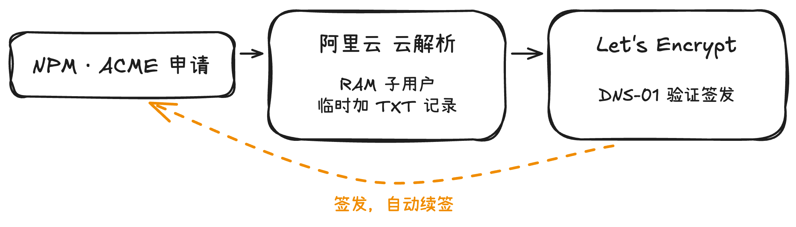
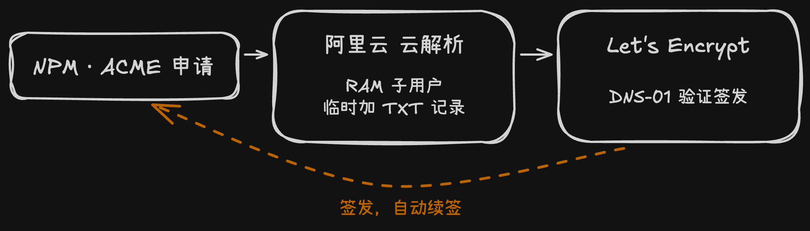

**目标**：在局域网内访问各类 HomeLab 服务（如 Homepage、Jellyfin、Portainer 等）时，直接使用自定义子域名并全程开启 HTTPS，且**不需要**在任何手机或电脑上安装自签名的根证书。

---

## 原理

不用"本地自建 CA 签发证书"方案，使用真实拥有的公网域名，通过向 Let's Encrypt 申请泛域名证书，结合本地路由器的 DNS 劫持，让内网流量直接导向本地反向代理网关（Nginx Proxy Manager）。

## 第一步：准备真实域名与 DNS API

1. **域名基础**：拥有一个真实注册的公网域名（`wolfden.website`），托管在阿里云。
2. **最小权限 API**：在阿里云 RAM 访问控制中，创建一个子用户。
3. **授权与隔离**：仅为该子用户授予"管理云解析（DNS）"的权限，并获取其 API Key (AccessKey ID / Secret)。

## 第二步：NPM 申请权威泛域名证书

1. **进入网关**：登录本地 Nginx Proxy Manager (NPM) 控制台。
2. **申请 SSL**：在 SSL Certificates 中添加新证书，域名填写泛域名格式：`*.wolfden.website` 以及 `wolfden.website`。
3. **DNS 验证：
   * 开启 `Use a DNS Challenge`。
   * DNS Provider 选择 `Aliyun`。
   * 填入第一步获取的子用户 API 凭据。
1. **签发逻辑**：NPM 会通过 API 自动在阿里云域名解析中添加一条临时 TXT 记录，向 Let's Encrypt 证明我确实拥有该域名。验证通过后，Let's Encrypt 下发一张合法证书（有效期 3 个月），后续自动续签。

这里阐述一下，签发 CA 证书的权威机构只负责向网站的用户确保一件事——响应真的是来自网站的拥有者，而不是中间人。所以权威机构只要开发者证明一件事——这个域名真的是属于开发者的。所以签发证书的过程就是，权威机构和开发者约定好一串密码，开发者给域名添加一条解析记录导向这串密码；权威机构一解析，发现指向的密码和自己手上的一样，这就说明这个域名真的属于申请证书的这位开发者，于是签发。

自动续签脚本干的事情就是，每天检测一下证书的有效期，差不多到期后就给权威机构发请求，同样约定密码、添加解析记录、拿到证书然后删除临时解析记录。

整个签发与自动续签的回路：

## 第三步：OpenWrt 内外网 DNS 分流

为了让内网设备访问子域名时不绕道公网，而在本地直接解析给 NPM，同时不影响主域名云端服务器的访问：

1. **局域网内设置 OpenWrt 旁路由为 DNS 服务器：** 由于小米路由器没有域名解析拦截功能，只能在下发 DHCP 报文时指定局域网内的 DNS 为 OpenWrt 的 ip。路由器下级的设备申请 ip 时就会拿到这个 DNS，后续域名解析都会找 OpenWrt，而小米路由器自己则会向外找 DNS。
2. **解析劫持（导向内网 NPM）**：
   在 OpenWrt 的 `DHCP/DNS -> 主机名映射` 中逐条添加记录
3. **主域名放行（导向公网云端）**：
   在 `主机名映射` 中不存在的域名，OpenWrt 则会交给上级 DNS，也就是小米路由器，转发到公网上，使得云服务器上的服务也能正常访问

> 注意：主机名映射对白名单内的 Ubuntu 服务节点（192.168.31.119）本身**不生效**——它的 DNS 请求会被 OpenClash 返回 fake-ip，在这台 VM 上访问本机服务要用 `127.0.0.1` 或 IP，不要用 wolfden 域名。详见 `修复配置 OpenWrt 旁路由为 DNS 服务器后的网络问题.md` 末尾的补充注意。

## 第四步：NPM 配置反向代理

1. 在 NPM 的 Proxy Hosts 中添加具体的内网服务。
2. 例如，将 `homepage.wolfden.website` 指向 Homepage 容器的内网地址及端口。
3. 勾选 **SSL**，选择刚才申请到的 Let's Encrypt 泛域名证书。

---

## 总结

* **传统本地 CA：** 自己用 OpenSSL 捏的证书，浏览器不认识。要手动把假 CA 导入 Windows、Mac、Android 的系统级信任区，否则浏览器会始终拦截并报错"连接不安全"。
* **目前方案**：现在的证书是 Let's Encrypt 签发的。由于 Let's Encrypt 本身就是 CA 机构，所有现代操作系统和浏览器出厂时就已经内置并信任了它。