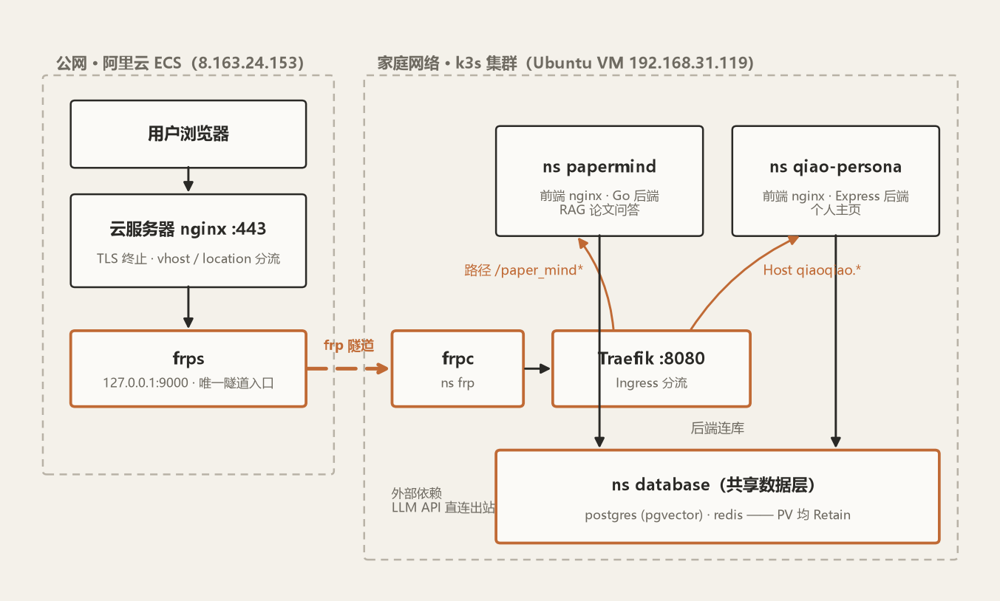

**环境：** HomeLab 单节点 k3s v1.36.2（PVE 上的 Ubuntu VM）+ 一台阿里云 ECS 做公网入口 + frp 内网穿透。

## 背景

上个周末，我把个人项目 PaperMind（Go 后端 + React 前端 + PostgreSQL/pgvector + Redis）整体搬上了 Homelab 的 k3s，并通过 frp 穿透公网上线。现在需要将第二个项目（对象个人主页，React + Express/Prisma）也上同一个集群——两个项目零冲突地共用着同一条隧道、同一个 Ingress、同一套数据层。

PaperMind 上线时，公网链路长这样：浏览器 → 云服务器 nginx（TLS 终止）→ frp 隧道（9000）→ 家里 k3s 的 Traefik → 各服务。其中有三点特殊的：

1. **frp 用纯 TCP 隧道**。云服务器上 frps 只开一个 `127.0.0.1:9000`，TLS 证书、域名分流全部交给云服务器上已有的 nginx。理由：阿里云安全组零改动，证书继续由 certbot 一处管理。
2. **Ingress 用 hostless 纯路径分流**。Traefik 的 Ingress 规则不匹配 Host，只看路径：`/paper_mind/` 给前端、`/paper_mind_api/` rewrite 后给后端。理由：公网入口形态自由——今天挂 `wolfden.website/paper_mind`，明天想换 `papermind.wolfden.website`，集群侧一行配置都不用改。
3. **数据层跟着应用走**。PostgreSQL 和 Redis 当时就塞进 `papermind` namespace，和应用同生命周期。理由：容易删。

## 数据库和 Redis 迁移为集群共享服务

现在需要部署第二个项目，对象的个人主页，React 前端 + Express/Prisma 后端 + PostgreSQL。也需要走隧道暴露到公网。

考虑过直接在新项目的 namespace 里再起一套 PG/Redis。但单节点 k3s 上跑两套数据库实在是太浪费了。更合理的是把数据层变成集群级共享服务。但有个问题：K8s 资源的 namespace 不可变，没有"移动"这个操作，只能在新 namespace 重建。

重建不是问题，数据才是。解法是一套通用流程，PG 和 Redis 各做一遍：

1. PV 的回收策略 patch 成 `Retain`（先做这步，否则删 PVC 会连数据一起删）；
2. 删除旧 namespace 的 Deployment 和 PVC（停机开始）；
3. 清掉 PV 的 `claimRef`，PV 变回 Available；
4. 新 namespace 重建同名 PVC、`volumeName` 指回原 PV——立即 Bound，数据原封不动；
5. 新 namespace（`database`）起 Deployment + Service，应用的配置指向 `postgres.database.svc.cluster.local`（停机结束）。

全程不用导一行数据，PG 和 Redis 各停机一两分钟。

共享服务的隔离约定也随之定下来：**PG 各项目建自己的库和用户；Redis 全集群共用一个密码，各项目用逻辑库号或 key 前缀隔离**。

## 部署第二个项目

接下来第二个项目（ns `qiao-persona`）的接入流程就特别简单了：

1. `kubectl create namespace` + 随机密码存 Secret；
2. 共享 PG 里 `CREATE USER` + `CREATE DATABASE`；
3. 构建镜像、导入 containerd、apply 清单；
4. 云服务器 nginx 加一个 vhost（`qiaoqiao.wolfden.website` → `127.0.0.1:9000`）+ 一条 DNS 解析。

其中：

- **Host 规则与无 host 兜底天然共存**。新项目的 Ingress 规则带 `Host: qiaoqiao.wolfden.website` 匹配，PaperMind 的 hostless 规则继续当兜底——Traefik 里带 Host 的规则优先匹配，两个项目零冲突，谁也不感知谁。
- **纯 TCP 隧道不关心域名**。第二个域名进来，frp 侧完全无感，一条 9000 隧道原样复用，不用加第二条隧道、不用动安全组。
- **数据层共享**。新项目 `DATABASE_URL` 指向 `database` namespace 即可，不用自己建数据库。

**新增一个项目的流程，压缩成"一份清单 + 一个 vhost + 一条 DNS"**。

## 现状

浏览器无论从哪个域名进来，都在云服务器 nginx 终止 TLS 后进同一条 frp 隧道；Traefik 按 Host 和路径分流到两个项目的 namespace；两个后端共用 `database` namespace 的 PostgreSQL 与 Redis（PV 均为 Retain）；外部依赖（PaperMind 的 LLM API）从集群直连出去。

后续规划：存储节点归位后扩多节点，顺便把私有镜像仓库搭起来（现在镜像靠 `docker save | k3s ctr images import` 手推，项目一多就烦了）。
