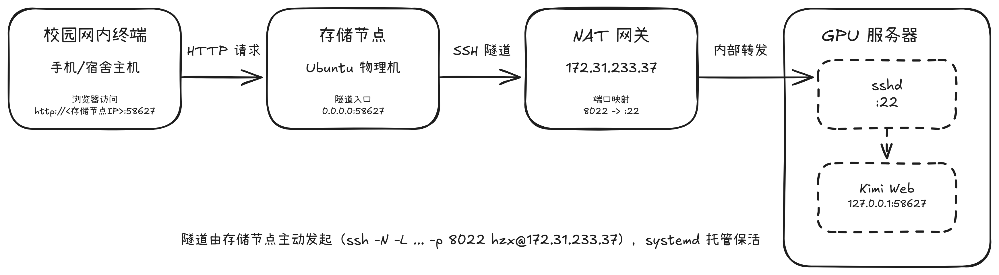
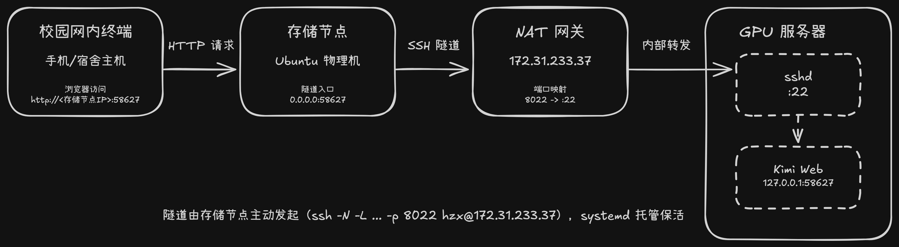

## 背景与问题

实验室有一台 GPU 服务器，平时我在上面跑实验，现在挂了一个 kimi web（AI agent 的 Web 前端，监听 `127.0.0.1:58627`）。

我希望在**校园网内的其他设备**（实验室电脑、宿舍电脑）上，通过浏览器直接访问这台服务器上的 Web 服务。但有个限制：

> **服务器的端口不对外开放** —— 用校园网也无法直接连到服务器的 58627 端口。

实验室网段下正好有一台 24 小时开机的存储节点 `wolf-storage-node`（Ubuntu Server，就是本博客 HomeLab 系列里那台，和服务器同在一个内网）。于是思路就是：**让存储节点当跳板，用 SSH 隧道把服务器的 Web 端口转发到存储节点上**。

## 网络拓扑

服务器本身藏在一个 NAT 网关后面。网关对外地址是 `172.31.233.37`，上面做了端口映射：`172.31.233.37:8022` → 服务器的 `:22`。





数据流：浏览器 → 存储节点:58627 → SSH 隧道 → 服务器的 127.0.0.1:58627（kimi web）。

> 备选方案说明：如果跳板机到不了服务器，就得反过来让**服务器主动发起**反向隧道（`ssh -R`）到跳板机。本文场景下存储节点能连到网关的 8022，所以用跳板机主动发起的**正向隧道**（`ssh -L`）即可，配置全部集中在跳板机上，服务器零改动，是最干净的方案。

## 方案实施

### 1. 免密登录

先在存储节点上生成 ssh 密钥对，然后把公钥复制进服务器的 `~/.ssh/authorized_keys` 中；

然后在存储节点上验证：

```bash
ssh -p 8022 <服务器用户名>@172.31.233.37 echo ok
```

### 2. 手动验证隧道

```bash
ssh -N -p 8022 -L 0.0.0.0:58627:127.0.0.1:58627 <服务器用户名>@172.31.233.37
```

- `-N`：不执行远程命令，只做转发。命令卡住不动是**正常的**，不要 Ctrl-C；
- `-L 0.0.0.0:58627:127.0.0.1:58627`：把存储节点所有网卡的 58627 转发到服务器回环的 58627。绑 `0.0.0.0` 是为了让校园网里其他设备也能通过存储节点访问；只给自己用就写 `127.0.0.1:58627:...`。

浏览器打开 `http://<存储节点IP>:58627/#token=<token>` 验证。

### 3. systemd 常驻 + 断线自愈

没有用 autossh——systemd 的 `Restart=always` 配上 ssh 自己的心跳参数就够了，少一个依赖：

```bash
sudo tee /etc/systemd/system/kimi-tunnel.service > /dev/null <<'EOF'
[Unit]
Description=SSH tunnel to lab server (kimi web)
After=network-online.target
Wants=network-online.target

[Service]
User=wolf
ExecStart=/usr/bin/ssh -N -T \
    -o ExitOnForwardFailure=yes \
    -o ServerAliveInterval=30 \
    -o ServerAliveCountMax=3 \
    -p 8022 \
    -L 0.0.0.0:58627:127.0.0.1:58627 \
    <服务器用户名>@172.31.233.37
Restart=always
RestartSec=5

[Install]
WantedBy=multi-user.target
EOF

sudo systemctl daemon-reload
sudo systemctl enable --now kimi-tunnel
```

三个关键 ssh 参数：

| 参数 | 作用 |
|---|---|
| `ExitOnForwardFailure=yes` | 转发建立失败时 ssh 直接退出，交给 systemd 重启，避免"进程活着但隧道是死的" |
| `ServerAliveInterval=30` | 每 30s 发一次心跳，对抗校园网会话过期、NAT 会话表超时 |
| `ServerAliveCountMax=3` | 连续 3 次心跳无响应判定断线，触发重连 |

### 4. 验证

```bash
systemctl status kimi-tunnel     # active (running)
ss -tln | grep 58627             # 0.0.0.0:58627
```

断网恢复 / 重启存储节点，隧道应在几秒内自动重建。

## 服务器侧的安全细节

kimi web 保持默认配置即可，两个点不要动：

- **绑定 `127.0.0.1`**：隧道只访问服务器回环，Web 服务本身不直接暴露在任何网卡上；
- **保留 bearer token 认证**。

kimi web 有 DNS-rebinding 检查，启动时加 `--allowed-host <存储节点IP>`。

## 如何彻底删除

不需要的时候，两步清干净：

```bash
sudo systemctl disable --now kimi-tunnel
sudo rm /etc/systemd/system/kimi-tunnel.service
sudo systemctl daemon-reload
```

可选收尾：服务器 `~/.ssh/authorized_keys` 里删掉存储节点的公钥。
